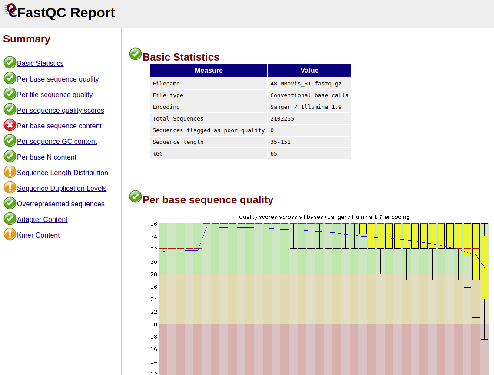

# Working with genomic data

The current worksheet aims to briefly documents the steps involved in the processing and analysis of whole genome sequencing data.

## A first look at raw sequencing data

### The `FASTQ` file

Sequencing data generally comes in `fastq` format. The `fastq` file contains each of the sequencing reads with its quality information:
```
@NB501589:38:H3HTTAFXY:1:11101:16760:1040 1:N:0:GCTCATGA+NATGCAGT
GCTCGNTGGTGGTGACCGTCGCGCTGCGCGGGCTATCGCGCAGCAGCGCGATTTCGCCGACGATCATGCCCGGCAGCGCCCGAGCGATGATCGCAACACCATCGTCGCCAACATGGCTGACTTCTGCGCTACCCGACGAGATAAGCAGAAA
+
AAAAA#EEEEEEEEEEEEEEEEEEEEEEEEEEEEEEEEEEEEEEEEEEEEEEEEEEEEEEEEEEEEEEEEEEEEEEEAEEEEEEEEEEEAEEEAEAEEEAEEEEEEEAAEEEEAEEEEEEEEEEEEAEEE<AEEEA/EEEEEEAAAEE<AE
```

The above text represents the information stored for a single read produced by an illumina NextSeq machine. It represents a single fragment of an *Mycobacterium bovis* genome. Each read is represented by 4 lines of text in a `fastq` file:

Line 1 provides the following information (more info [here](https://help.basespace.illumina.com/articles/descriptive/fastq-files/)):
```
@<instrument>:<run number>:<flowcell ID>:<lane>:<tile>:<x-pos>:<y-pos> <read>:<is filtered>:<control number>:<sample number>
```

Line 2: is a single read sequence, which corresponds to a short fragment of a genome

Line 4: contains the quality scores. Each character represents a single number based on the ASCII code of each character (more info [here](https://support.illumina.com/help/BaseSpace_OLH_009008/Content/Source/Informatics/BS/QualityScoreEncoding_swBS.htm)):

| Symbol | ASCII code | Q Score | | Symbol | ASCII code | Q Score |
|--------|------------|---------|-|--------|------------|---------|
| \!     | 33         | 0       | | 3      | 51         | 18      |
| "      | 34         | 1       | | 4      | 52         | 19      |
| \#     | 35         | 2       | | 5      | 53         | 20      |
| $      | 36         | 3       | | 6      | 54         | 21      |
| %      | 37         | 4       | | 7      | 55         | 22      |
| &      | 38         | 5       | | 8      | 56         | 23      |
| '      | 39         | 6       | | 9      | 57         | 24      |
| \(     | 40         | 7       | | :      | 58         | 25      |
| \)     | 41         | 8       | | ;      | 59         | 26      |
| *      | 42         | 9       | | <      | 60         | 27      |
| +      | 43         | 10      | | =      | 61         | 28      |
| ,      | 44         | 11      | | >      | 62         | 29      |
| -      | 45         | 12      | | ?      | 63         | 30      |
| .      | 46         | 13      | | @      | 64         | 31      |
| /      | 47         | 14      | | A      | 65         | 32      |
| 0      | 48         | 15      | | B      | 66         | 33      |
| 1      | 49         | 16      | | C      | 67         | 34      |
| 2      | 50         | 17      | | D      | 68         | 35      |

### How well did the sequencing run go?

[`fastqc`](https://www.bioinformatics.babraham.ac.uk/projects/fastqc/) is an open source piece of software that is used look at the quality of sequencing reads in a `fastq` file. To install `fastqc`, use one of the following links:

- Windows/Linux: https://www.bioinformatics.babraham.ac.uk/projects/fastqc/fastqc_v0.11.8.zip
- Mac: https://www.bioinformatics.babraham.ac.uk/projects/fastqc/fastqc_v0.11.8.dmg

You can run `fastqc` on a pair of `fastq` files either by opening them from within the fastqc program or by using the following code:
```
fastqc --threads 2 48-MBovis_R1.fastq.gz 48-MBovis_R2.fastq.gz
```
The above code will generate a selection of files. The ones we're interested in are the `.html` files. Clicking on these files will get you an output like this:



The `html` files contain a series of summary plots that tell us about the quality of the sequencing data. Here is a brief description of the most useful parts of the `fastqc` output.

#### `fastqc`: Basic statistics

The first part of the `fastqc` output provides important statistics that allow us to quickly check whether the sequencing run went ok. It is important to check the **Total Sequences**, **Sequence length**, and **%GC** values.

> QUESTION:<br>
> 1. What values would you expect for these three statistics?

For *M. bovis* genomic data, I like to have more than 250,000 read sequences, the read length is usually 150bp but that depends on the run, and the %GC is 65%.

> QUESTION:<br>
> 1. Why does the sequence length range from 35 to 151bp?

#### `fastqc`: Per base sequence content

Each read represents a random fragment of the genomic DNA or its complement. Therefore, on average for every `A` we would expect to see a `T`, for every `C` a `G` and so on...

The **Per base sequence content** plot uses this to check the quality of the reads, where the proportion of `A`s versus `T`s or `C`s versus `G`s deviates at a position in the reads it can be considered a signal of poor quality.

Generally the accuracy of sequencing deteriorates towards the ends of the reads, so we will often see deviations at the start and end of this figure.

The **Per base sequence content** plot is useful for defining your trimming parameters.

> QUESTIONS:<br>
> 1. How much would you trim off the right?
> 2. How much off the left?

#### `fastqc`: Per sequence GC content

Each organism's genome has a particular bias in its nucletide content. For example, *M. bovis* has a GC rich genome (lots of `C`s and `G`s). As each read represents a random fragment of the genome, and we have hundreds of thousands of them, so by counting the numbers of `C`s and `G`s in our reads we can get a good estimate of the genomes GC bias.

I find the **Per sequence GC content** plot really useful for spotting contamination. If we have accidentally sequenced a different species as well as *M. bovis*, and it has a different GC bias, this plot will look strange and our average GC content won't be 65%.

#### `fastqc`: Further reading

Make sure and take a look through the rest of the `fastqc` output. Also, the `fastqc` help pages provides examples of [good](https://www.bioinformatics.babraham.ac.uk/projects/fastqc/good_sequence_short_fastqc.html) and [bad](https://www.bioinformatics.babraham.ac.uk/projects/fastqc/bad_sequence_fastqc.html) fastqc outputs that would worth taking a look at.


## Starting to process the sequencing data

### Installing `cutadapt`

As we saw from the `fastqc` outputs, most sequencing data how some minor quality issues. By trimming the raw sequencing data we can improve the efficiency of our downstream analyses without impacting their accuracy.

There are loads of tools available for trimming raw sequencing data in `fastq` format. [Here](https://journals.plos.org/plosone/article?id=10.1371/journal.pone.0085024) is a really nice summary of the different tools available and the benefits of trimming.

The important thing with trimming is to be conservative, if we're too harsh we might end up removing informative data. In contrast, if we're too lenient then it probably just take a wee bit longer.

I use `cutadapt`, to install it use one of the following options (more info [here](https://cutadapt.readthedocs.io/en/stable/installation.html)):

- Linux: `sudo apt install cutadapt`
- Windows: see info [here](https://www.biostars.org/p/85788/)
- Mac: `sudo easy_install cutadapt`

### Trim bad bits off reads

In the command line I can trim my raw sequence reads with the following command:

```
# Set the number of threads
NTHREADS=4

# Set your trimming parameters here
QUALITY=25 # Quality threshold used to filter poor quality reads
MINLENGTH=50 # Threshold to filter reads out that are too short
TRIMLEFTFORWARD=10 # Number of sites to remove from left of forward reads
TRIMRIGHTFORWARD=0 # Number of sites to remove from right of forward reads
TRIMLEFTREVERSE=10 # Number of sites to remove from left of forward reads
TRIMRIGHTREVERSE=0 # Number of sites to remove from right of forward reads

# Note the names of the input raw sequencing fastq files
FORWARD="48-MBovis_R1.fastq.gz"
REVERSE="48-MBovis_R2.fastq.gz"

# Name the output files
TRIMMEDFORWARD="48-MBovis_R1_trimmed.fastq.gz"
TRIMMEDREVERSE="48-MBovis_R2_trimmed.fastq.gz"

# Run cutadapt
cutadapt -b AGATCGGAAGAG -B AGATCGGAAGAG -b CTGTCTCTTATA -B CTGTCTCTTATA -o $TRIMMEDFORWARD -p $TRIMMEDREVERSE $FORWARD $REVERSE --minimum-length=$MINLENGTH --quality-cutoff=$QUALITY,$QUALITY -u $TRIMLEFTFORWARD -u -$TRIMRIGHTFORWARD -U $TRIMLEFTREVERSE -U -$TRIMRIGHTREVERSE --cores=$NTHREADS
```

The above code uses `cutadapt` to trim the forward and reverse sequence reads for a single sample (`48-Mbovis`). The above quality settings are most of the ones I commonly use. Based on the **Per base sequence content** plot from `fastqc`, I usually change the four different trimming parameters (`TRIMLEFTFORWARD`, `TRIMRIGHTFORWARD`, `TRIMLEFTREVERSE`, `TRIMRIGHTREVERSE`).

`cutadapt` is an extremely flexible, take a look at some of its additional parameters with the following command (more info [here](https://cutadapt.readthedocs.io/en/stable/guide.html)):
```
cutadapt --help
```

### Let's start aligning!

### Installing `bwa`

We generally work with *Mycobacterium* complex species, these are haploid bacteria with conserved genomes that have little or no recombination. For *M. bovis*, these traits mean that there is little variation between samples and we can use reference genome alignment to look at the variation in our samples.

Reference genome alignment maps sequence reads against a known genome sequence (reference) that is likely to be very similar to the sample.

For *M. bovis* the [AF2122/97](https://www.ncbi.nlm.nih.gov/nuccore/LT708304) is usually used.

One of the most commonly used tools for reference genome alignment is [`bwa`](http://bio-bwa.sourceforge.net/). We can install bwa on a Linux machine using the following code:
```
sudo apt install bwa
```

### Downloading a reference genome

Next, before we do our alignment, we'll first need to download the `fasta` file for the reference genome. You can download the `fasta` file by going to [this](https://www.ncbi.nlm.nih.gov/nuccore/LT708304) page and clicking "Send to", select "File", and then select the `FASTA` format. Put the downloaded file into a folder (I called mine `"Reference"`). We can index the reference genome `fasta` file with the following command:
```
bwa index Reference/Mbovis_LT708304-1.fasta
```

### Align your sample to the reference

Now we can align our trimmed data for the sample (`48-MBovis`), which we produced with `cutadapt`, with the following code:
```
# Note the names of the trimmed read files
TRIMMEDFORWARD="48-MBovis_R1_trimmed.fastq.gz"
TRIMMEDREVERSE="48-MBovis_R2_trimmed.fastq.gz"

# Set the number of threads
NTHREADS=4

# Name the output file
SAMFILE="48-MBovis_aligned.sam"

# Note the path and name of reference genome
REFERENCE="Reference/Mbovis_LT708304-1.fasta"

# Run the alignment
bwa mem -t $NTHREADS $REFERENCE $TRIMMEDFORWARD $TRIMMEDREVERSE > $SAMFILE
```

### Installing `samtools`

The aligned data is stored in a `SAM` file (Sequence Alignment Map), which is similar in structure to the `fastq` file, except both forward and reverse reads are present in a single file and the coordinates of each read on the reference genome are recorded (more info [here](http://samtools.github.io/hts-specs/SAMv1.pdf)).

In order to view the variation that is present in our sample, we need to use a program called [samtools](http://samtools.sourceforge.net/). `samtools` is a collection tools that are used to view and process the information in a `SAM` file.

We can install samtools on a Linux machine with the following command:
```
sudo apt install samtools
```

### Working on the `SAM` file

We're going to use `samtools` to process our `SAM` file and get it ready for us to examine the variation. Run these commands:

```
# Set the number of threads
NTHREADS=4

# Note the name of the SAM file
SAMFILE="48-MBovis_aligned.sam"

# Convert SAM to BAM
BAMFILE="48-MBovis_aligned.bam"
samtools view --threads $NTHREADS -b $SAMFILE > $BAMFILE

# Sort the aligned reads
SORTEDBAMFILE="48-MBovis_aligned_sorted.bam"
samtools sort $BAMFILE -o $SORTEDBAMFILE --threads $NTHREADS

# Index the sorted reads
samtools index $SORTEDBAMFILE -@ $NTHREADS

# Remove duplicates
NODUPLICATES="48-MBovis_aligned_sorted_rmDuplicates.bam"
samtools rmdup $SORTEDBAMFILE $NODUPLICATES
```

### Installing `bcftools`

Now we have our aligned data stored in a `BAM` format, which is a compressed form of the `SAM` file. In the `BAM` file each read is stored with quality information and coordinates on the reference genome. The `BAM` file is essential storing a summary of something like this:


The next stage is see how different our sample is from the reference genome, this is known as calling variants.

> QUESTION:<br>
> 1. Can you see any variation in the example above?

We can use [`bcftools`](https://samtools.github.io/bcftools/) to call variants present in a `BAM` file. You can install `bcftools` on Linux using (more info [here](https://samtools.github.io/bcftools/)):
```
sudo apt install bcftools
```

### Convert that `BAM` to a `VCF`

Now, we can use `bcftools` to call the variants in our data with the following commands:
```
# Set the number of threads
NTHREADS=4

# Set some quality filters
ADJUST=50 # Parameter to adjust quality scores
MAPQUALITY=30 # Skip aligned reads with quality score less than this
BASEQUALITY=20 # Skip bases with quality score less than this

# Note the name of the BAM file without duplicates
NODUPLICATES="48-MBovis_aligned_sorted_rmDuplicates.bam"

# Create a BCF file (compressed form of VCF)
BCFFILE="48-MBovis_variants.bcf"
bcftools mpileup $NODUPLICATES --threads $NTHREADS --adjust-MQ $ADJUST --min-MQ $MAPQUALITY --min-BQ $BASEQUALITY --fasta-ref $REFERENCE --output-type b --output $BCFFILE

# Convert BCF to VCF
VCFFILE="48-MBovis_variants.vcf"
bcftools call $BCFFILE --ploidy 1 --multiallelic-caller --output-type v --threads $NTHREADS --variants-only --output-type v --output $VCFFILE
```

> QUESTION:<br>
> 1. Why is setting a mapping quality filter important?

The `VCF` (Variant Calling Format) file was produced using the code above, it stores information about variants. Variants are differences between a sample and a reference, these can be single nucleotide differences (SNPs) or small sequences being present or absent (INDELs).

> QUESTIONS:<br>
> 1. What does SNP stand for?
> 2. What does INDEL stand for?

Here is the first few lines of the `VCF` file we produced.
```
##fileformat=VCFv4.2
##FILTER=<ID=PASS,Description="All filters passed">
##bcftoolsVersion=1.9+htslib-1.9
##bcftoolsCommand=mpileup --threads 4 --adjust-MQ 50 --min-MQ 30 --min-BQ 20 --fasta-ref Reference/Mbovis_LT708304-1.fasta --output-type b --output 48-MBovis_variants.bcf 48-MBovis_aligned_sorted_rmDuplicates.bam
##reference=file://Reference/Mbovis_LT708304-1.fasta
##contig=<ID=LT708304.1,length=4349904>
##ALT=<ID=*,Description="Represents allele(s) other than observed.">
##INFO=<ID=INDEL,Number=0,Type=Flag,Description="Indicates that the variant is an INDEL.">
##INFO=<ID=IDV,Number=1,Type=Integer,Description="Maximum number of reads supporting an indel">
##INFO=<ID=IMF,Number=1,Type=Float,Description="Maximum fraction of reads supporting an indel">
##INFO=<ID=DP,Number=1,Type=Integer,Description="Raw read depth">
##INFO=<ID=VDB,Number=1,Type=Float,Description="Variant Distance Bias for filtering splice-site artefacts in RNA-seq data (bigger is better)",Version="3">
##INFO=<ID=RPB,Number=1,Type=Float,Description="Mann-Whitney U test of Read Position Bias (bigger is better)">
##INFO=<ID=MQB,Number=1,Type=Float,Description="Mann-Whitney U test of Mapping Quality Bias (bigger is better)">
##INFO=<ID=BQB,Number=1,Type=Float,Description="Mann-Whitney U test of Base Quality Bias (bigger is better)">
##INFO=<ID=MQSB,Number=1,Type=Float,Description="Mann-Whitney U test of Mapping Quality vs Strand Bias (bigger is better)">
##INFO=<ID=SGB,Number=1,Type=Float,Description="Segregation based metric.">
##INFO=<ID=MQ0F,Number=1,Type=Float,Description="Fraction of MQ0 reads (smaller is better)">
##FORMAT=<ID=PL,Number=G,Type=Integer,Description="List of Phred-scaled genotype likelihoods">
##FORMAT=<ID=GT,Number=1,Type=String,Description="Genotype">
##INFO=<ID=ICB,Number=1,Type=Float,Description="Inbreeding Coefficient Binomial test (bigger is better)">
##INFO=<ID=HOB,Number=1,Type=Float,Description="Bias in the number of HOMs number (smaller is better)">
##INFO=<ID=AC,Number=A,Type=Integer,Description="Allele count in genotypes for each ALT allele, in the same order as listed">
##INFO=<ID=AN,Number=1,Type=Integer,Description="Total number of alleles in called genotypes">
##INFO=<ID=DP4,Number=4,Type=Integer,Description="Number of high-quality ref-forward , ref-reverse, alt-forward and alt-reverse bases">
##INFO=<ID=MQ,Number=1,Type=Integer,Description="Average mapping quality">
##bcftools_callVersion=1.9+htslib-1.9
##bcftools_callCommand=call --ploidy 1 --multiallelic-caller --output-type v --threads 4 --variants-only --output-type v --output 48-MBovis_variants.vcf 48-MBovis_variants.bcf; Date=Wed Dec 11 14:17:27 2019
#CHROM  POS     ID      REF     ALT     QUAL    FILTER  INFO    FORMAT  48-MBovis_aligned_sorted_rmDuplicates.bam
LT708304.1      1057    .       A       G       225     .       DP=115;VDB=0.429871;SGB=-0.693147;MQSB=0.972083;MQ0F=0;AC=1;AN=1;DP4=0,0,64,39;MQ=46    GT:PL   1:255,0
LT708304.1      8741    .       T       C       225     .       DP=134;VDB=0.99467;SGB=-0.693147;MQSB=0.893286;MQ0F=0;AC=1;AN=1;DP4=0,0,68,45;MQ=46     GT:PL   1:255,0
...
```

There are a lot of lines beginning with `##`. These `##` lines are the header lines, which contain information about some of the quality statistics that are stored in the `VCF` file.

The first line of interest is the one beginning with `#CHROM`, which contains the column headers. Each line that follows contains information about a position in the sample's genome. Here is a brief description of the information found in each line (more info [here](https://samtools.github.io/hts-specs/VCFv4.2.pdf)):

- `POS` <position>: position on the reference genome
- `REF` <reference>: nucleotide(s) at the position in reference
- `ALT` <alternate>: nucleotide(s) at the position in sample
- `INFO` <information>: quality information summarising reads aligned at the position. These are the ones I look at:
  - `DP` <read depth>: the number of reads aligned at position
  - `DP4`<high quality read depth>: four numbers recording the number of high quality reads supporting:
    1. **Reference** nucleotide(s) in **forward** direction
    2. **Reference** nucleotide(s) in **reverse** direction
    3. **Alternate** nucleotide(s) in **forward** direction
    4. **Alternate** nucleotide(s) in **reverse** direction
  - `MQ` <mapping quality>: a score of well the reads were aligned to the position


> QUESTIONS:<br>
> 1. Can you guess why the `VCF` starts at position `1057`?
> 2. What is the nucleotide for our sample at position `8741`?
> 3. Are these two variants likely to be correct (present in our *M. bovis* sample)?

## Wrapping it up

So we've raced through how reference genome alignment can work. Here we used it to see what variation was present in a sample. There are lots of different ways/tools to do the tasks set out above, so it is important to take a look at how other people are processing their sequencing data as well.

If you have any further questions, then drop me an email: [crispelljoseph@gmail.com](crispelljoseph@gmail.com).
